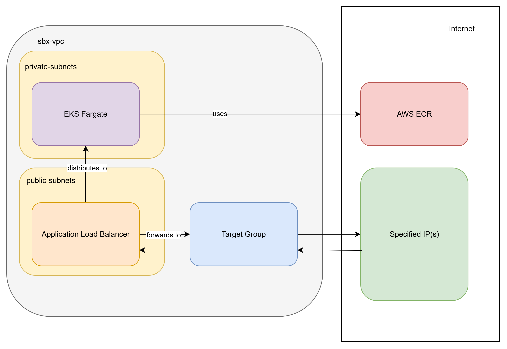

## Ethan

The clusters sit in the private subnets in the existing sandbox VPC. For command line purposes our IP is whitelisted on the cluster endpoint. Then the docker image sitting on AWS ECR is used in the container and deployed to the cluster on port 80 (type is ClusterIP for now). Then a target group is created in the same VPC with the node IPs as targets. Then an internet facing application load balancer is created in the public subnets and whitelisted IPs are included in its security group. This security group is also added in an inbound rule in the cluster security group. The web app can now be accessed by the whitelisted IP(s) using the ALB DNS.

## Diyali

1. Create the EKS Fargate cluster on existing private subnets (API endpoint is public and private with my ip address)
   - EKS (Elastic Kubernetes Service) is AWS’s managed Kubernetes platform.
   - Fargate lets you run containers without managing servers.
   - Using private subnets so your app runs in the VPC
   - The cluster endpoint is both public and private, meaning -
     - access the Kubernetes API from the internet (public) but only from your IP.
     - Internal AWS services can also access it (private).

2. Create the ECR and push the docker image
   - ECR (Elastic Container Registry) is where you store your Docker images.
   - In order to create and push the docker image you would have to:
     - Build your React app into a Docker image
     - Tag it
     - Push it to ECR
   - EKS pulls your app from ECR to run it.

3. Create an application load balancer (using the existing public subnets)
   - The application load balancer distributes traffic to your app pods
   - It has to be created using existing public subnets so the load balancer is internet facing:
     - Public subnets enable DNS resolution, private subnets block direct internet access
   - this is how users access your React app.
   - ALB handles incoming traffic and routes it to your app.
   - It supports HTTPS and can scale automatically.

4. The load balancer target group - uses cluster's pod's ip addresses
   - In fargate, the React app runs in pods, which have IP addresses
   - Hence, the need for the target group to register these pod IP addresses

5. load balancer security group that has port 80 and 443 with our ip addresses for inbound rules
   - HTTP (port 80) and HTTPS (port 443) are available only for my ip address

6. Add the ALB Security group as an inbound rule (port 80) on the Fargate pod’s security group which is the one attached to the ENIs (Elastic Network Interface)
   - This is needed because the ALB receives traffic from my IP address
   - When it tries to forward that traffic to the pods, the clusters security group blocks it and the React app won't load - without the ALB sg being added to the clusters sg

* ENI (Elastic Network Interface):
  - Created when a Fargate pod is launched
  - This gives the Pod its IP address
  - Its then attached to a security group (governs inbound and outbound traffic to the pod)

#### Access Flow:
1. User opens browser and hits the ALB DNS
2. ALB receives the request on port 80 or 443
3. ALB forwards the request to the target group
4. The security group attached to the Fargate pod's ENI allows traffic because the ALB’s security group is whitelisted in its inbound rules.
5. The pod responds, and the app loads in your browser.
